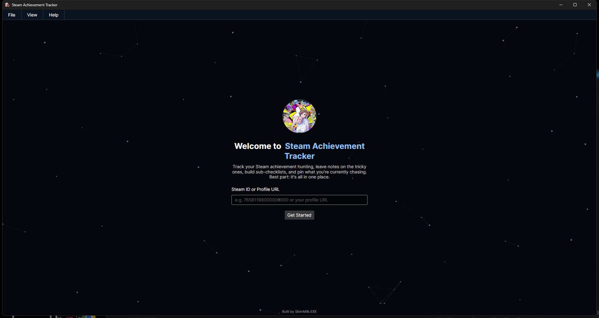
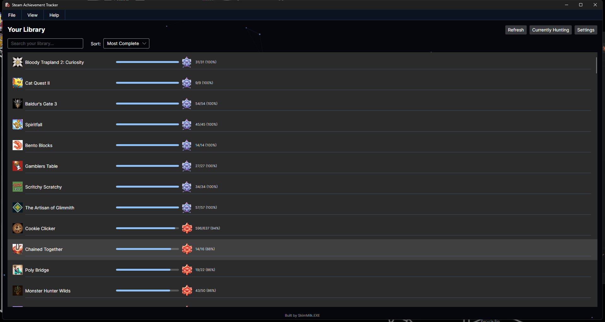
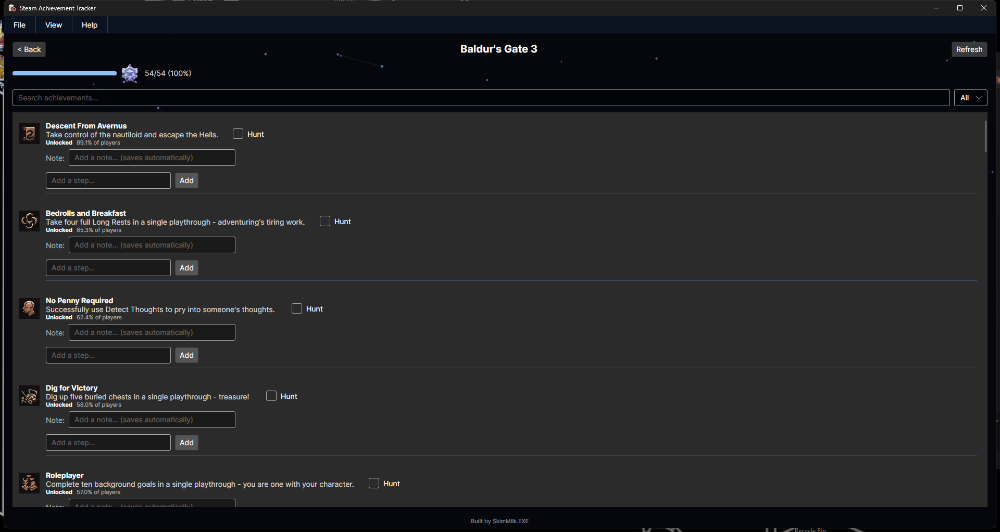
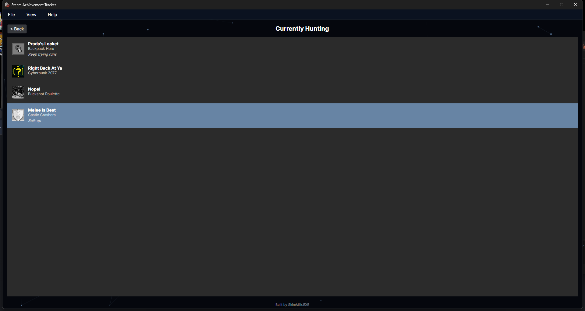

# Steam Achievement Tracker

A desktop app for tracking Steam achievement hunting: browse your library, dig into each game's achievements, jot notes and build sub-checklists for the tricky ones, and pin what you're currently chasing to a dedicated list.

Built by [SkimMilk.EXE](https://skimmilkexe.dev).

## Screenshots

| Welcome | Library |
|---|---|
|  |  |

| Game Detail | Currently Hunting |
|---|---|
|  |  |

## Features

- **Library view** of your owned Steam games with icons and completion bars
- **Game detail view**: every achievement merged with your unlock status, description, icon, and global rarity %
- **Trophy badges** (Bronze/Silver/Gold/Platinum) that appear on a game's progress bar as you cross 25/50/75/100% completion
- **Per-achievement notes** and **manual sub-checklists** for tracking hints or steps toward a tricky achievement
- **"Currently Hunting"** list of pinned achievements, so you always know what you're chasing
- **Local SQLite cache** for instant loads and offline browsing, with a background warmup that slowly backfills completion data for your whole library without hitting Steam's rate limits
- **Search, sort, and filter**: search your library or an achievement list, sort games by name/completion, filter achievements by rarest/easiest/missing
- **Light/dark theme**, with an option to reveal hidden achievement details before you unlock them
- No Steam API key required — the app talks to a small Cloudflare Worker backend that holds the key server-side

## Getting Started

1. Download the latest release from the [Releases page](https://github.com/SkimMilkEXE/Steam-Achievement-Tracker/releases).
2. Run `SteamAchievementTracker.exe` — no installation needed.
3. Enter your Steam ID64 or full profile URL on the welcome screen.

Your Steam profile and game details need to be public for the app to read your library and achievements.

## Building from source

Requires the [.NET 10 SDK](https://dotnet.microsoft.com/download).

```
dotnet run
```

To publish a self-contained single-file build (matches what's shipped in Releases):

```
dotnet publish -c Release -r win-x64 --self-contained \
  -p:PublishSingleFile=true \
  -p:IncludeNativeLibrariesForSelfExtract=true \
  -p:DebugType=none \
  -p:CopyDebugSymbolFilesFromPackages=false
```

The output lands in `bin/Release/net10.0/win-x64/publish/`.

## Tech stack

- C# / .NET 10 with [Avalonia UI](https://avaloniaui.net/) (cross-platform, MVVM)
- [CommunityToolkit.Mvvm](https://github.com/CommunityToolkit/dotnet)
- SQLite via Microsoft.Data.Sqlite + Dapper for the local cache and notes
- A [Cloudflare Worker](backend/) backend that proxies the Steam Web API so no one needs their own API key

## Privacy

The app only talks to its own Cloudflare Worker (which calls the official Steam Web API) and to Steam's CDN for icons. No data is collected or sent anywhere else. Your notes, checklists, and cached library data are stored locally on your machine.
